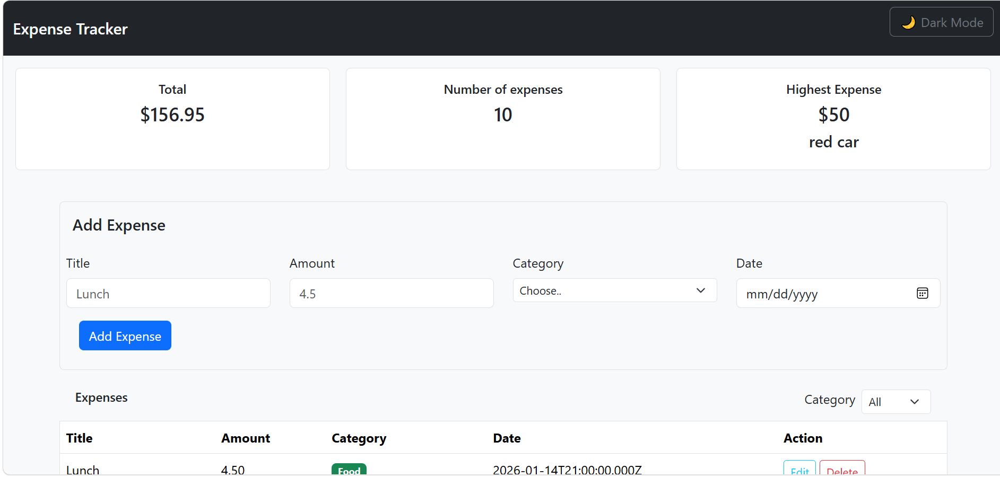
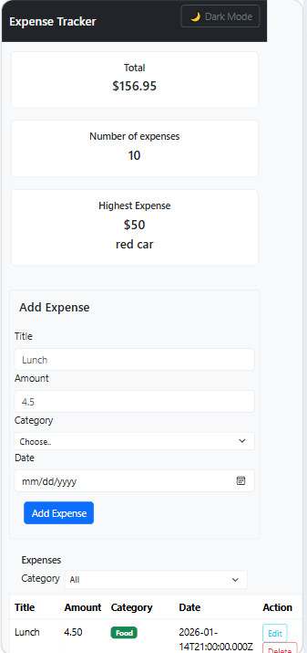

# Expense Tracker

🔗 **GitHub Repository:** [https://github.com/ayakaraf28/expense-tracker](https://github.com/ayakaraf28/expense-tracker)

 A dynamic full-stack web application designed to help users efficiently manage and track their personal finances. It allows users to add, edit, delete, and filter expenses, with interactive visual insights via charts, summary statistics, exportable CSV reports, dark mode support, and a bulk-delete feature. 

## How to run

### Prerequisites
Make sure you have Node.js, PostgreSQL, and VS Code installed on your system.

**Backend**

1. **Clone or open the repository** in VS Code.
2. **Install dependencies:**
   Open the terminal in the root directory and run:
   ```bash
   npm install express pg cors dotenv
   Database Configuration:

3. **Open PostgreSQL (pgAdmin or psql).**

4.**Create a new database (e.g., expense_tracker_db).**

5.**Run the provided schema.sql script to create the necessary table structure.**

#Environment Variables:

Create a .env file in the root directory.
**Code sippet
Add your database credentials:
DB_HOST=localhost
DB_PORT=5432
DB_USER=your_postgres_username
DB_PASSWORD=your_postgres_password
DB_NAME=expense-tracker

6.**Start the backend server by command node server.js, the server will connect to PostgreSQL and listen for incoming REST API requests**

**Frontend**

1. Ensure the backend server is running.

2. Open index.html in your browser (or use VS Code's Live Server extension).

2. The frontend will connect to the backend REST API endpoints to fetch, display, and interact with the        PostgreSQL data in real time.

## Features

<!-- List what your app can do. Tick what you finished. -->

1- [x] Add an expense (with form validation)

2- [x] Delete an expense

3- [x] Edit an expense

4- [x] Filter expenses by category

5- [x] Summary cards (Total, Expense Count, Highest Expense) using CSS Grid

6- [x] Interactive Chart.js visualizations

7- [x] Export expenses to CSV file

8- [x] Dark Mode toggle

9- [x] Bulk Delete ("Delete All" expenses)

10-[x] Data is saved in a PostgreSQL database

11-[x] Fully responsive layout across mobile and desktop devices

## Screenshots & Demo

### Desktop View


### Mobile View

## Demo Video

🎬 **Watch the App Demo:** [Expense Tracker Demo Video](https://drive.google.com/file/d/10oCMNU2WeJ_t9v7iVWCioM614KUg-1Zu/view?usp=sharing)

## What was the hardest part?

The most challenging aspect was integrating the frontend with the backend REST API, as it was my first time connecting a client-side interface to a full Express.js & PostgreSQL pipeline. Without a predefined template to follow, I spent considerable time researching official documentation, analyzing code examples, and testing fetch requests until I gained a solid grasp of end-to-end data flow.

Additionally, implementing extra features like the CSV export required deep diving into native Web APIs (such as Blob objects and UTF-8 encoding),it was a valuable learning curve that strengthened my overall problem-solving and full-stack development skills